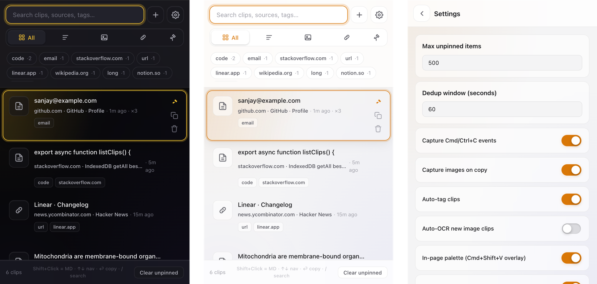

# Context Clipboard 📋

Smart clipboard manager for **Chrome, Brave, Edge, and Firefox**. Every copy remembers where it came from — URL, page title, surrounding paragraph — and yes, it captures **images** too.

**Site:** https://sanjays2402.github.io/context-clipboard/

   

<p align="center">
  
</p>
<p align="center"><sub>Dark popup · Light popup · Settings — captured at 2× from the actual production build</sub></p>

## What's new in v0.6.0

- **Side panel mode** — toggle in Settings to open the clipboard in Chrome's side panel instead of a popup. Always-on while you browse.
- **Bulk select + actions** — Cmd/Ctrl+click clips to select, then pin, tag, or delete in one shot. `X` toggles select on the active clip, `Esc` clears selection.
- **Chrome Web Store ready** — LICENSE, PRIVACY.md, and per-permission justifications shipped in `docs/store-listing.md`.

## What's new in v0.5.0

- **Smart field suggestions** — when you focus the same input on the same site, a frosted-glass chip offers the clip you pasted there last time.
- **Liquid Glass UI** — iOS 18-inspired frosted surfaces, ambient color blobs, cubic-bezier easing.
- **Phosphor SVG icons** — emoji replaced with stroke-based scalable icons.

## Features

- **Text + images + links** — `Ctrl/⌘+C` and right-click "Capture" both work
- **Page context** — URL, title, favicon, and the surrounding paragraph saved with every clip
- **Smart dedup** — re-copying the same content within a configurable window bumps hit count instead of duplicating
- **In-page command palette** — `Cmd/Ctrl+Shift+V` opens a Spotlight-style overlay on any page; navigate + paste without leaving the tab
- **Auto-tags** — hostname, `code`, `email`, `url`, `jwt`, `phone`, `long`, `number` detected locally
- **Tag filter chips** — top tags rendered above the list, click to filter
- **Image OCR** — extract text from screenshots with Tesseract.js (lazy-loaded), searchable in history
- **Pin important clips** — survive auto-prune and "Clear unpinned"
- **Paste as Markdown** — quotes get `>` blockquote with citation, code gets fenced ` ``` ` block, images get ``
- **Detail view** — full content, hit count, editable tags, source link, context paragraph, OCR text
- **Keyboard-first** — `↑/↓` navigate, `Enter` copy, `Shift+Enter` markdown, `P` pin, `Del` delete, `/` search, `Esc` back
- **Drag & drop images** into the popup to capture instantly
- **Quick notes** — add manual text via the `+` button
- **Allow / Block lists** — never capture on banking pages, or only capture on your work domains
- **Storage indicator** — see used / quota with a live bar
- **Export / Import JSON** — back up, restore, sync between browsers
- **Themes** — auto / dark / light
- **Local-only** — IndexedDB, no cloud, no account, no telemetry
- **Cross-browser** — Chrome / Brave / Edge / Firefox 121+ (MV3)

## Install (dev)

```bash
npm install
npm run build         # builds dist/chrome and dist/firefox
```

### Chrome / Brave / Edge

1. Open `chrome://extensions`
2. Enable **Developer mode**
3. Click **Load unpacked** → select `dist/chrome/`

### Firefox

1. Open `about:debugging#/runtime/this-firefox`
2. Click **Load Temporary Add-on**
3. Select `dist/firefox/manifest.json`

## Keyboard shortcuts

| Key | Action |
|---|---|
| `Cmd/Ctrl+Shift+V` | Open in-page palette (or popup) |
| `↑` / `↓` | Navigate clips |
| `Enter` | Copy active clip |
| `Shift+Enter` | Copy as Markdown |
| `P` | Pin / unpin |
| `Delete` | Delete clip |
| `/` | Focus search |
| `Esc` | Close detail / settings / palette |

## Architecture

- **`content.ts`** intercepts `copy` events on every page (text + images), and renders an isolated **shadow-DOM palette** when summoned by the background.
- **`background.ts`** owns the IndexedDB store, dedup, context menus, allow/block lists, command shortcut routing, and RPC bus.
- **`popup/`** is a single-page UI with list + detail + settings views, drag-drop image capture, and on-demand Tesseract.js OCR.
- **`lib/db.ts`** wraps IDB with search, indexes (`hash`, `lastSeenAt`, `kind`), auto-prune, and full export / import.

## Project layout

```
src/
├── background.ts        # MV3 service worker
├── content.ts           # copy capture + in-page palette (shadow DOM)
├── lib/
│   ├── db.ts            # IndexedDB store
│   ├── types.ts         # ClipItem, Settings
│   └── util.ts          # hash, autoTag, time/host helpers
└── popup/
    ├── popup.html
    ├── popup.css        # dark + light themes
    └── popup.ts         # list / detail / settings, OCR, drag-drop
manifests/
├── chrome.json          # MV3 (Chrome/Brave/Edge)
└── firefox.json         # MV3 (Firefox 121+)
scripts/
├── build.mjs            # esbuild → dist/<target>/
└── make-icons.py        # Pillow-generated PNGs
icons/                   # 16/32/48/128/256
```

## Roadmap

- [ ] Cloud sync via GitHub Gist (optional)
- [ ] Encrypted export with passphrase
- [ ] Per-clip privacy redaction (auto-mask emails / tokens)
- [ ] Chrome Web Store + addons.mozilla.org submission
- [ ] LLM auto-tagging via WebGPU (Transformers.js)

## License

MIT
